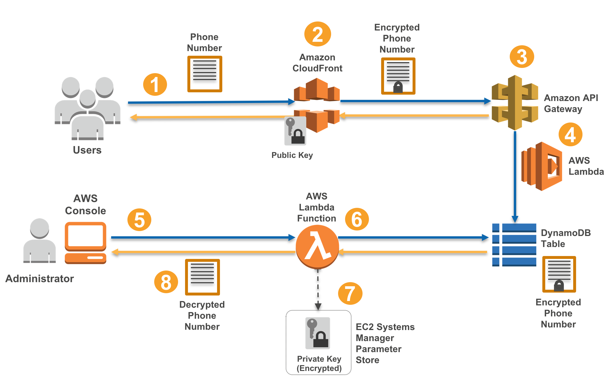

# Enhance the Security of Sensitive Customer Data by Using Amazon CloudFront Field-Level Encryption

***The complete post for this solution is [available on the AWS Security Blog](https://aws.amazon.com/blogs/security/).***

### How CloudFront field-level encryption works

Many web applications must collect data from users. For example, a travel booking website may ask for your passport number, as well as additional data such as your name, phone number, and email address. This data is transmitted to web servers and also might travel among a number of services to perform useful work. However, this also means that user's information may need to be accessed by only a small subset of these services, and most others do not need to access this data.
This data is often stored in a database for retrieval at a later time. One approach to protecting stored sensitive data is to configure and code each service and database access to ensure that sensitive data is protected. For example, you can develop safeguards in logging functionality to ensure sensitive data is masked or removed. This can add complexity to your code base and limit performance.

Field-level encryption addresses this problem by ensuring sensitive data is encrypted at edge locations. Sensitive data fields in HTTPS form PUT/ POSTs are automatically encrypted with a user-provided public RSA key. After the data is encrypted, all other systems in your architecture see only ciphertext. Even if this ciphertext unintentionally becomes externally available, the data is cryptographically protected and only designated systems with access to the private RSA key can decrypt the sensitive data.
It is critical to secure private RSA key material to prevent unauthorized access to the protected data. Management of cryptographic key material is a larger topic that is out of scope for this blog post, but should be carefully considered when implementing encryption within your applications. For example, in this blog post we store the private key material as a secure string in the EC2 Systems Manager Parameter Store. The parameter store provides a centralized store to manage your configuration data such as plaintext data (e.g., database strings) or secrets (e.g., passwords) that are encrypted using AWS Key Management Service (AWS KMS). You may have an existing key management system in place that you can use, or you can use AWS CloudHSM. CloudHSM is a cloud-based hardware security module (HSM) that enables you to easily generate and use your own encryption keys in the AWS Cloud.

To illustrate Field-level encryption, let's look at a simple form submission, where Name and Phone values are sent to a web server using an HTTP POST.  A typical form POST would contain data such as the following.

~~~
POST / HTTP/1.1
Host: foo.com
Content-Type: application/x-www-form-urlencoded
Content-Length: 13

Name=Bob&Phone=1235551212

Field-level encryption converts this data to the following.
POST / HTTP/1.1
Host: foo.com
Content-Type: application/x-www-form-urlencoded
Content-Length: 13

Name=Bob&Phone=<encrypted>ejYx52fxx2jjnwetvxx</encrypted>
~~~

To further demonstrate field-level encryption in action, this blog post includes a sample Serverless Application that you can deploy by using CloudFormation. This CloudFormation template creates an application environment using Amazon CloudFront, Amazon API Gateway and AWS Lambda.The following diagram depicts the sample application architecture and data flow.

### Architecture Overview

Here is how the process works:

1.	An application user submits an HTML form page with sensitive data, generating an HTTPS POST to CloudFront.
2.	Field-level encryption intercepts the form POST and encrypts sensitive data with the public RSA key and replaces fields in the form post with encrypted ciphertext. The form POST ciphertext is then sent to origin servers.
3.	The serverless application accepts the form post data containing cipher text where sensitive data would normally reside. If a malicious user were able to compromise your application and gain access to your data, such as the contents of a form, this data is encrypted.
4.	AWS Lambda stores data in a DynamoDB table, leaving sensitive data to remain safely encrypted at rest.
5.	An administrator the AWS Console and a Lambda function to view the sensitive data.
6.	During the session, the administrator retrieves cipher text from the DynamoDB table.
7.	An administrator decrypts sensitive data using private key material stored in EC2 Systems Manager Parameter Store.
8.	Finally, decrypted sensitive data is transmitted over SSL/TLS via the AWS console to the administrator for review.
